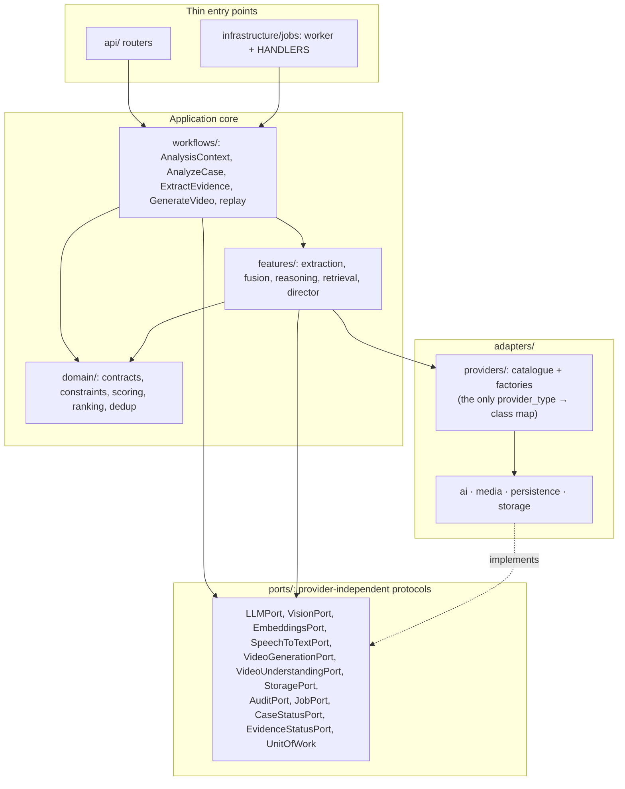

# Architecture

## Purpose

BAKKE is an **Evidence-Constrained Hypothesis Intelligence** system. It never determines
*what happened*. Instead it:

1. Extracts facts from every evidence item.
2. Discovers constraints (temporal, spatial, presence, causation, physical).
3. Generates multiple scenarios (hypotheses) that are *compatible with* the evidence.
4. Eliminates scenarios that violate hard constraints, via an iterative adversarial
   review + expansion loop.
5. Ranks the survivors with an **Evidence Consistency Score** (consistency with available
   evidence — **not** a likelihood or verdict).
6. Renders a labelled, visual-only **3D animated reconstruction** of a scenario.

Everything is auditable: every step is written to an `audit_events` trail.

## Repository layout

```
apps/
  backend/
    app/
      main.py            # FastAPI app; lifespan validates config; CORS
      config.py          # capability specs, resolve_capability, validate_settings
      database.py        # engine, session, get_db (commits on success)
      domain/            # pure rules: contracts, scoring, ranking, dedup, constraints/
      ports/             # provider-independent Protocols (see below)
      adapters/
        ai/              # http_chat (chat/embeddings), mock_llm, embeddings_mock, rule_based
        media/           # http_chat (vision/STT/video understanding), mock,
                         #   vendor_video (kling/runway/hailuo), schematic (ffmpeg mock render)
        persistence/     # SqlAlchemyUnitOfWork + runtime_config (DB provider overrides)
        providers/       # provider catalogue + factory functions (the ONLY type -> class map)
        storage/         # local disk (default) + Firebase storage
      features/          # case, evidence, analysis, scenarios, visualization services/agents
      workflows/         # context, analyze_case, extract_evidence, generate_video,
                         # manifest (replay manifests), replay (offline re-run)
      prompts/           # PROMPT_VERSION, TASK_SCHEMAS, loader + prompts/v1/*.md
      api/               # routers: cases, scenarios, providers, replay + auth deps
      infrastructure/
        jobs/            # worker (poll loop), tasks.py (thin dispatch), audit service
        agents/          # BaseAgent harness (agents call LLMPort, never a vendor)
        ids.py hashing.py
      models/ schemas/   # SQLAlchemy ORM models / Pydantic DTOs
    tests/               # unit/ contract/ integration/ e2e/
    alembic/ scripts/    # migrations; seed_demo, seed_reference_cases
  frontend/              # Next.js App Router (app/, components/, features/, hooks/, lib/)
docs/                    # architecture, api, database, setup, testing, video-pipeline
scripts/                 # repo-level seed_demo launcher
Makefile  docker-compose.yml  .env.example
```

## Layering

Dependencies point toward the core: entry points call workflows, workflows and features
call ports and domain rules, and adapters implement the ports. Persistence and provider
access never leak into the domain layer.



- **domain/** has no imports from SQLAlchemy, adapters or HTTP — enforced by
  `tests/unit/test_domain_and_prompts.py`.
- Code asks the catalogue (`adapters/providers`) for a *provider instance* and then uses
  it only through its port protocol. The catalogue is the only place that maps a
  configured `provider_type` to a concrete class; adding a provider means registering it
  there, never editing workflows or features.
- **api/** and **jobs/tasks.py** only enqueue/dispatch: `HANDLERS` maps a job type to
  exactly one workflow (`ANALYZE_CASE → AnalyzeCaseWorkflow`,
  `GENERATE_VIDEO → GenerateVideoWorkflow`).
- Two deliberate wiring exceptions live at the edges, not in the core: `workflows/replay.py`
  constructs a `SqlAlchemyUnitOfWork` and forces `mock_providers()`, and case file storage
  goes through the `adapters/storage` factory (`get_storage_provider`).

## Provider-agnostic capabilities

Six capabilities, each configured by the same four generic environment keys
`<PREFIX>_PROVIDER_TYPE`, `<PREFIX>_API_BASE_URL`, `<PREFIX>_API_KEY`, `<PREFIX>_MODEL`
(see `.env.example` for the authoritative list):

| Capability | Port | Env prefix | Adapter types (`*_PROVIDER_TYPE`) |
|---|---|---|---|
| text | `LLMPort` | `LLM` | `mock`, `http_chat` |
| embeddings | `EmbeddingsPort` | `EMBEDDING` | `mock`, `http_chat` |
| speech | `SpeechToTextPort` | `STT` | `mock`, `http_chat` |
| vision | `VisionPort` | `VISION` | `mock`, `http_chat` |
| video understanding | `VideoUnderstandingPort` | `VIDEO_UNDERSTANDING` | `mock`, `http_chat` |
| video generation | `VideoGenerationPort` | `VIDEO_GENERATION` | `mock`, `kling`, `runway`, `hailuo` |

- `http_chat` speaks the de-facto `/chat/completions`, `/embeddings`,
  `/audio/transcriptions` dialect over plain HTTP (no vendor SDK); it requires
  `API_BASE_URL`, `API_KEY` and `MODEL`.
- Video generation has no `http_chat`: each vendor adapter (`app/adapters/media/vendor_video.py`)
  encodes its own submit/poll endpoint and requires `VIDEO_GENERATION_API_KEY`.
- Unknown types are rejected at build time (`ProviderConfigurationError`) and at write
  time by `PUT /api/providers`.

### Resolution precedence

`resolve_capability()` (`app/config.py`) resolves each capability in this order:

1. **runtime DB override** — `provider_settings` table, written through
   `PUT /api/providers`, cached in-process for 2s, applied without a restart;
2. **generic env** — `<PREFIX>_*` keys from the environment / `.env`;
3. **legacy env** — `OPENAI_API_KEY`, `LLM_PROVIDER`, `OPENAI_MODEL`, `<X>_PROVIDER`, …
   (`openai` is normalized to `http_chat`; a legacy `OPENAI_API_KEY` alone supplies the
   OpenAI base URL);
4. **default** — explicit `mock`.

### Explicit mock, no silent fallback

- The default configuration runs entirely locally: every capability resolves to `mock`.
- A non-mock type without credentials fails loudly (at construction, or on first use for
  vendor video adapters); there is no fallback to another provider.
- Mocks are labelled **DEVELOPMENT MOCK** and reported as `is_mock: true` by
  `GET /api/providers`; evidence is only ever sent to explicitly configured providers.
- `app/main.py` runs `validate_settings() + validate_provider_types()` at startup:
  in **production** any error aborts startup (`ConfigError`); in development the same
  problems are logged as warnings so the stack stays runnable.
- Production validation additionally requires a unique `SECRET_KEY`, an explicit
  non-wildcard `CORS_ALLOW_ORIGINS`, Firebase auth configuration and `DATABASE_URL`.
- The only forced-mock switch is `mock_providers()`, an explicit context manager used by
  offline replay. Tests select mocks explicitly through configuration instead
  (`tests/conftest.py` sets every `*_PROVIDER_TYPE=mock`). A live run never falls back
  to a mock.

## Pipelines

`POST /api/cases/{id}/analyze` enqueues `ANALYZE_CASE`; the worker
(`app/infrastructure/jobs/worker.py`, DB polling with best-effort Redis wake-up) claims
it and runs `AnalyzeCaseWorkflow`:

```
evidence ──ExtractEvidenceWorkflow──▶ facts + entities + findings + timeline
   │                                          │
   └──fusion──────────────────────────────────┘
                                              ▼
                          similar-case retrieval (embeddings; reference ONLY)
                                              │
                                              ▼
                          ReasoningEngine + domain constraint engine:
                              generate candidate hypotheses from the fact base
                              → iterative adversarial loop (≤ MAX_REASONING_ITERATIONS):
                                 review vs constraints & facts
                                 → HARD violation?  REJECT
                                 → weak / unexplored?  REVISE / EXPAND, regenerate
                              → Evidence Consistency Score + ranking (survivors)
                                              │
                                              ▼
                          audit entries + replay manifest (data/replay/)
```

`POST /api/cases/{id}/scenarios/{sid}/visualize` enqueues `GENERATE_VIDEO`;
`GenerateVideoWorkflow` builds the visual-only spec, renders the MP4 (mock: schematic
ffmpeg clip; live: vendor adapter) and writes its own manifest.

Every run shares one `AnalysisContext` (`workflows/context.py`): a `run_id`, the active
`PROMPT_VERSION`, provider labels, and timed stages — the same values appear in logs,
audit entries and manifests.

## Versioned prompts

- Prompt text lives in `app/prompts/v1/*.md` (`_base.md` plus one file per task).
- `PROMPT_VERSION` (`app/prompts/__init__.py`) is stamped into every audit entry and
  replay manifest; changing a prompt incompatibly means adding `v2` and bumping it.
- `LLM_TASKS` is the task catalogue; `TASK_SCHEMAS` gives five tasks typed output
  contracts (`ExtractionResult`, `HypothesisSet`, `CritiqueResult`, `RevisionResult`,
  `ExpansionResult`). Mock **and** live providers pass through
  `validate_task_output()` — malformed output raises instead of degrading silently.

## Replay and offline manifests

- At the end of every AnalyzeCase / GenerateVideo run a manifest is written to
  `{DATA_DIR}/replay/{case_id}.{kind}.json` (`manifest_version: 1`): run id, stage
  timings, provider labels, prompt version. Analysis manifests (kind `analysis`) add
  evidence content hashes and result counts; video manifests use kind
  `video_{scenario_id}` and record the scenario/video ids and status.
- `POST /api/cases/{id}/replay` (`{job_type: ANALYZE_CASE | GENERATE_VIDEO}`) re-runs
  the workflow inside `mock_providers()` — no external API calls. The replay's own
  manifest is stored beside the original as `{kind}.replay`, and the original recording
  is restored untouched.
- `GET /api/cases/{id}/replay/manifest?kind=analysis` returns a recorded manifest.
  e2e coverage: `tests/e2e/test_replay.py`.

## Audit trail

Workflows persist through `UnitOfWork` ports; `SqlAlchemyAudit.record()` appends an
`AuditEvent` (action, agent, provider, summary, source object ids, `prompt_version`;
the `extra` JSON carries the `run_id` and stage counts). Extraction failures, fusion,
similar-case retrieval, each reasoning iteration, scoring and video generation all
record. Read via `GET /api/cases/{id}/audit`.

## Test layering

| Layer | Directory | Covers |
|---|---|---|
| unit | `tests/unit` | domain rules, config resolution + validation, prompts/contracts |
| contract | `tests/contract` | port conformance, http_chat adapter against a mocked transport, catalogue errors |
| integration | `tests/integration` | full workflow runs on a real (temp) database: demo pipeline, video isolation, zero survivors |
| e2e | `tests/e2e` | FastAPI `TestClient` flows: capabilities/provider API, analysis flow, replay |

## Key design decisions

- **Evidence Consistency Score, never probability.** The score reflects how well a
  scenario is supported by the currently available evidence; it is not a claim about
  likelihood of truth.
- **Reference, not precedent.** Retrieved similar cases provide *patterns and ideas* for
  hypothesis generation. Their conclusions are never injected as facts.
- **Hard constraints eliminate; soft constraints weigh.** A hard-constraint violation
  rejects the scenario outright; soft constraints reduce its score.
- **Video is visual-only and labelled.** The director receives only the scenario's visual
  description (locations, objects, actors, timing), never case reports, evidence IDs, or
  forensic reasoning. Every video is labelled *NOT RECORDED FOOTAGE*.
- **Audit everything.** Extraction, fusion, constraint checks, adversarial iterations,
  scoring, ranking, and video generation are all recorded with agent, provider, and
  source object ids.
- **Pluggable providers with safe defaults.** The default configuration runs entirely
  local and deterministic; switching to real providers requires explicit config and
  never leaks evidence to providers that aren't configured.
